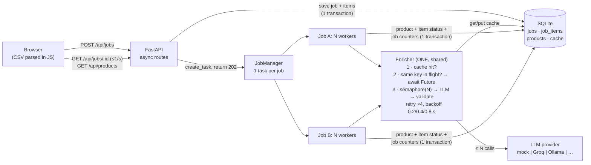

# CatalogIQ – System Design

## 1. Architecture

**A job's path.** `POST /api/jobs` validates the body, writes the job and all its items to SQLite in one transaction, and starts a background task with `asyncio.create_task`. It returns `202` in milliseconds, without awaiting the task. The task marks the job `running` and starts `LLM_CONCURRENCY` workers, which share one iterator over the job's pending items. Each worker calls `Enricher.enrich()`:

1. It computes `content_key` = SHA-256 of the lowercased title + description with whitespace collapsed.
2. If the key is in the cache table, the result is returned as a cache hit.
3. If the same key is **in flight**, the worker awaits that call's `asyncio.Future` (shielded, so one cancelled waiter can't cancel it for everyone).
4. Otherwise the worker registers a Future and makes up to 4 attempts. Each attempt holds one slot of a **single `asyncio.Semaphore(N)`** owned by the one `Enricher` that every job shares. The slot is released during the backoff sleep. Invalid JSON or an unknown category counts as a failed attempt.

The worker then saves the product row, the item status and the job counters in one transaction. When all workers finish, the job is `completed`.

**What runs in parallel:** jobs run side by side, and so do workers within a job. LLM calls overlap up to N; the limit is enforced by the semaphore alone. The API keeps answering throughout, because every route is a short `async def` on the same event loop.

**Why asyncio.** The work is almost entirely *waiting* on the network. An event loop holds thousands of waiting tasks cheaply, and it only switches tasks at `await`. That makes the de-duplication check ("in cache? in flight? register") atomic without locks, which makes it easy to reason about and to test.

**Rejected alternatives:**
- *Threads:* would work, but the in-flight map and the metrics would need locks, and each blocked thread costs memory.
- *Processes:* useful for CPU-bound work, which this isn't. A cross-process semaphore and in-flight map would need IPC.
- *Celery + Redis:* the right shape at scale (see §3), but too much infrastructure for this scope.
- *One task per item:* 10k tasks would queue on the semaphore, and a second job would wait behind all of them. A per-job worker pool makes jobs take turns.
- *A semaphore per job:* breaks the global limit.
- *Writing products at submit time with a `pending` status:* the contract allows only enriched/failed/approved, so raw input waits in `job_items` instead.

## 2. Crash recovery

**What the code does today.** Progress is saved per item, in the same transaction as the product row and the job counters. On startup the lifespan calls `resume_unfinished()`, which restarts every job still `queued` or `running`. Each resumed job loads only its items still marked `pending`:
- **Finished work is never redone.**
- **No item is lost.**
- The counters continue from where they stopped, and `started_at` is kept.

The only repeated work is the at most N items that were mid-call during the crash. Even those are often cache hits, because the cache is written as soon as an answer validates. This is covered by `test_restart_resumes_without_redoing_finished_work` and `test_jobs_resume_after_restart`.

**What I'd add with more machines:**
- **Leases instead of "the process that started it":** add `claimed_by`, `claimed_until` to `job_items`. A worker claims a batch with a conditional `UPDATE`, renews the lease while working, and any node can pick up expired claims. This is also what a queue with visibility timeouts (SQS, Redis Streams) gives you.
- **Idempotent writes (already true):** re-processing an item is an upsert keyed by SKU, so a duplicate delivery is harmless.
- **Graceful shutdown:** stop taking new items, then let in-flight calls finish for a few seconds before cancelling them.

## 3. Scale and cost: 1 million listings a day

1M/day is about **11.6 listings/s, or about 700/min**. With a free tier around 30 requests/min, one request per product can't keep up; even paid tiers make this the bottleneck. In order of impact:

1. **Cache first.** Exact-content de-duplication is already in place, and marketplaces repeat listings heavily (the same product from many sellers). A normaliser that also unifies units ("500G" = "500 gm") would raise the hit rate further. The cache must live in a shared store (Postgres or Redis) once there are several machines.
2. **Batch several products per prompt.** 20 products per request turns 700 req/min into about **35 req/min**. It also pays for the long system prompt once instead of 20 times, which cuts input tokens by roughly 60–70%. The trade-off: a malformed reply fails 20 items. So validate per item, and retry only the ones that failed, alone or in smaller batches.
3. **One shared rate limiter.** The semaphore limits *concurrency*; a provider limits *requests and tokens per minute*. The app already has an in-process pacer (`app/ratelimit.py`), measured on Groq's free tier: 14 calls/min gave 30/30 products with zero 429s. At scale, the same idea becomes a token bucket in Redis that every worker on every machine takes from, measured in tokens (not calls), and honouring `Retry-After` on a 429.
4. **Horizontal workers + a real queue.** The API only enqueues. Stateless workers pull from a queue (SQS or Redis Streams) with leases (§2). Capacity is then governed by the shared limiter, not by how many machines are running.
5. **Cheapest model that is good enough, plus a fallback.** Use a small model (e.g. an 8B) first. On repeated 429s or 5xx, or low-quality output (§5), fall back to a second provider or a larger model, behind a circuit breaker. The provider interface already makes this a new class, not a rewrite.
6. **Spread the load.** Accept jobs all day, but process at a steady rate, with priority for interactive uploads over bulk backfills.

## 4. API performance: `GET /api/products?q=...` at 5 million products

**What's slow:**
- `LIKE '%q%'` has a leading wildcard, so no B-tree index can help. Every search scans all 5M rows, over two columns.
- `COUNT(*)` for `total` scans all the matching rows again.
- `OFFSET` pagination reads and throws away every skipped row, so page 10,000 is slow.
- With SQLite, one long query also blocks writers and, in this app, the event loop.

**Fixes:**
1. **Full-text search:**
   - SQLite `FTS5`: a virtual table over `clean_title` and `raw_title`, kept in sync with triggers.
   - Or, on Postgres, `tsvector` + a GIN index, and `pg_trgm` for substring and typo-tolerant matching.
   - At larger scale, OpenSearch.
2. **Keyset (cursor) pagination:** `WHERE sku > :last_sku ORDER BY sku LIMIT 20` uses the primary key and costs the same on every page. The API returns an opaque `next_cursor`. Offset paging can stay for the first few pages.
3. **Cheaper totals:** an approximate count, a capped count ("1,000+"), or a cached count per category.
4. **Indexes that match the queries:** `(category, sku)` exists already, so a filter plus sort needs no extra sort step.
5. **Caching:** short-TTL caching of popular queries and of the first page per category (a Redis or HTTP cache with `ETag`). Invalidate when products change.
6. **Infrastructure:** move to Postgres with read replicas for search traffic, and run DB calls off the event loop (`asyncio.to_thread` or an async driver).

## 5. Quality: invented brands, wrong categories

**Automatic checks after validation.** They flag a product; they don't reject it.
- **Brand grounding:** the brand's normalised tokens must appear in the raw title or description. If not, it's likely invented, so flag it and consider setting it to null.
- **Title grounding:** every number or unit in `clean_title` must exist in the raw text. This catches invented sizes.
- **Category cross-check:** compare against a cheap keyword classifier (like the mock's rules) or embedding similarity to known products. Flag disagreements.
- **Self-consistency:** for uncertain items, ask twice (or ask a second model). Disagreement means low confidence.
- **Known lists:** a curated brand list per category ("Colgate" in Electronics is suspicious).

**Deciding what a human reviews (a priority queue):**
1. `failed` products.
2. Products with a failed grounding check.
3. Category disagreement or low confidence.
4. High-traffic products (errors there cost most).
5. A small random sample (e.g. 2%) of everything, to measure real accuracy per category and per model version.

**Closing the loop.** Every approval with edits becomes a labelled example. Use them as few-shot examples in the prompt and as an evaluation set for comparing prompts or models. Watch the edit rate per category: a rising rate is the early warning.
