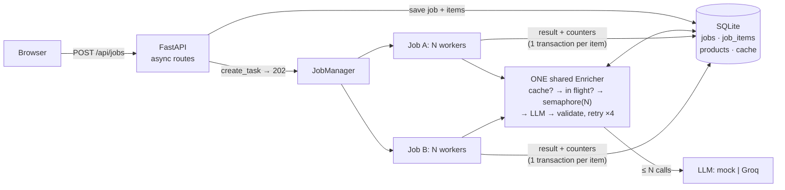

# CatalogIQ – System Design

## 1. Architecture

**A job's path.** `POST /api/jobs` saves the job and all its items in one transaction, starts a background task with `asyncio.create_task` (not awaited), and returns `202` in milliseconds. The task runs `LLM_CONCURRENCY` workers over the job's pending items. For each item, `Enricher.enrich()` does three things:
1. It computes a content key: SHA-256 of the title + description, lowercased, with whitespace collapsed.
2. **Cache hit?** Return the stored answer. **Same key in flight?** Await that call's `asyncio.Future` (shielded, so one cancelled waiter can't cancel it for everyone).
3. Otherwise it makes up to **4 attempts**, with backoff of 0.2/0.4/0.8 s. Each attempt holds one slot of a **single `asyncio.Semaphore(N)`**, in the one Enricher that every job shares. The slot is released while sleeping. Invalid JSON or an unknown category counts as a failed attempt.

The product, the item's status and the job counters are then saved in one transaction.

**Parallelism:** jobs run side by side, and so do workers within a job. The semaphore alone caps LLM calls at N across all of them. The API stays fast because every route is a short `async def` on the same event loop.

**Why asyncio:** the work is almost entirely waiting on the network. An event loop holds thousands of waiting tasks cheaply, and it only switches tasks at `await`. So "in cache? in flight? register" runs atomically, without locks.

**Rejected alternatives:**
- **Threads:** the in-flight map and the metrics would need locks.
- **Processes:** this isn't CPU-bound, and a cross-process semaphore needs IPC.
- **Celery + Redis:** right at scale (§3), but too much infrastructure here.
- **One task per item:** a second job would queue behind 10k tasks; a per-job worker pool lets jobs take turns.
- **A semaphore per job:** breaks the global limit.

## 2. Crash recovery

**Already implemented and tested.** Progress is saved per item, in the same transaction as the product row and the counters. At startup, `resume_unfinished()` restarts every `queued` or `running` job, and each one loads **only its items still `pending`**. Finished work is never redone and no item is lost. The only repeats are the at most N items that were mid-call, and those are often cache hits.

**With more machines:**
- **Leases:** `claimed_by` / `claimed_until` columns on `job_items`, claimed with a conditional `UPDATE`, so any node can take over expired claims. A queue with visibility timeouts (SQS, Redis Streams) gives the same.
- **Idempotent writes:** results are upserted by SKU, so processing an item twice is harmless (already true).

## 3. Scale and cost: 1M listings/day

That is about **700 listings per minute**. On Groq's free tier (measured: about 8,000 tokens/min, so about 15 calls/min) one call per product can't keep up. In order of impact:

1. **Cache first.** Sellers relist the same products. Exact de-duplication already exists; unifying units ("500G" = "500 gm") raises the hit rate. At scale, move the cache to Postgres or Redis.
2. **Batch ~20 products per prompt.** That is about 35 requests/min instead of 700, and the long system prompt is paid once instead of 20 times (roughly 60–70% fewer input tokens). Validate per item and retry only the failures.
3. **A shared rate limiter.** The semaphore caps *concurrency*, but providers cap *requests and tokens per minute*. `app/ratelimit.py` already paces calls: at 14/min, a live Groq run did 30/30 with zero 429s. At scale, use a token bucket in Redis shared by every worker, counting tokens and honouring `Retry-After`.
4. **Stateless workers on a queue**, with leases (§2), so capacity is set by the limiter, not the number of machines.
5. **The cheapest good-enough model**, with a fallback provider behind a circuit breaker. The provider interface makes that a new class, not a rewrite.

## 4. Search performance at 5M products

**What's slow:**
- `LIKE '%q%'` can't use an index, so every search scans every row.
- `COUNT(*)` scans the matching rows again.
- `OFFSET` reads and discards every skipped row.

**Fixes:**
1. **Full-text search:** SQLite FTS5, or Postgres `tsvector` + GIN with `pg_trgm` for substrings and typos; OpenSearch beyond that.
2. **Keyset pagination:** `WHERE sku > :last ORDER BY sku LIMIT 20` costs the same on page 1 and page 10,000.
3. **Cheaper totals:** approximate, capped ("1,000+"), or cached per category.
4. **Caching:** short-TTL caching of popular queries and first pages, invalidated when products change.
5. **Postgres with read replicas**, and DB calls moved off the event loop.

## 5. Quality: invented brands, wrong categories

**Automatic checks.** They flag a product rather than reject it.
- **Grounding:** the brand, and every number or unit in the clean title, must appear in the raw text. The live Groq run invented "Pack of 2" from "with 2 cartridges", which exactly this check catches.
- **Category cross-check:** a cheap keyword classifier (like the mock's rules). Disagreement means flag it.
- **Self-consistency:** ask twice, or ask a second model. Different answers mean low confidence.

**The human review queue, in priority order:**
1. `failed` products
2. failed grounding checks
3. low confidence
4. high-traffic products
5. a 2% random sample, to measure real accuracy per category

Every approval with edits becomes a labelled example, used for few-shot prompts and for evaluating prompt or model changes. A rising edit rate in a category is the early warning.
